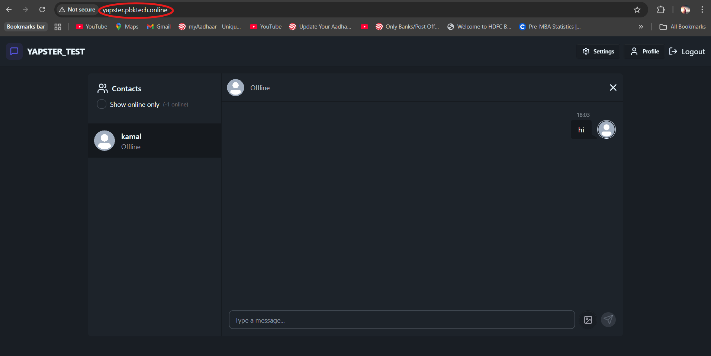
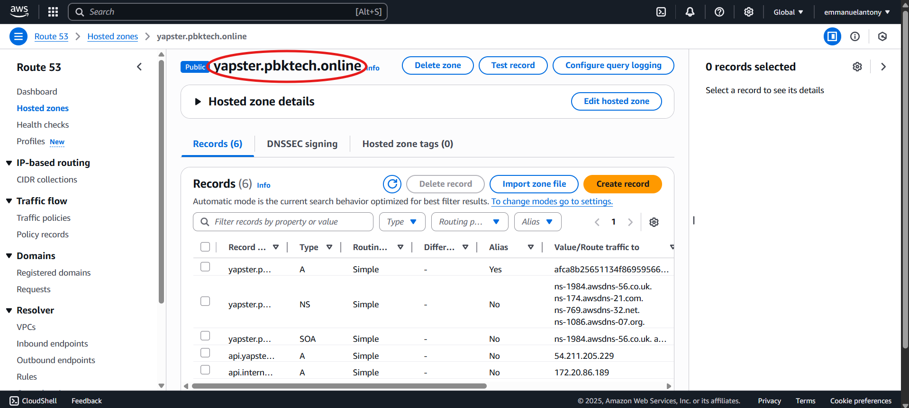
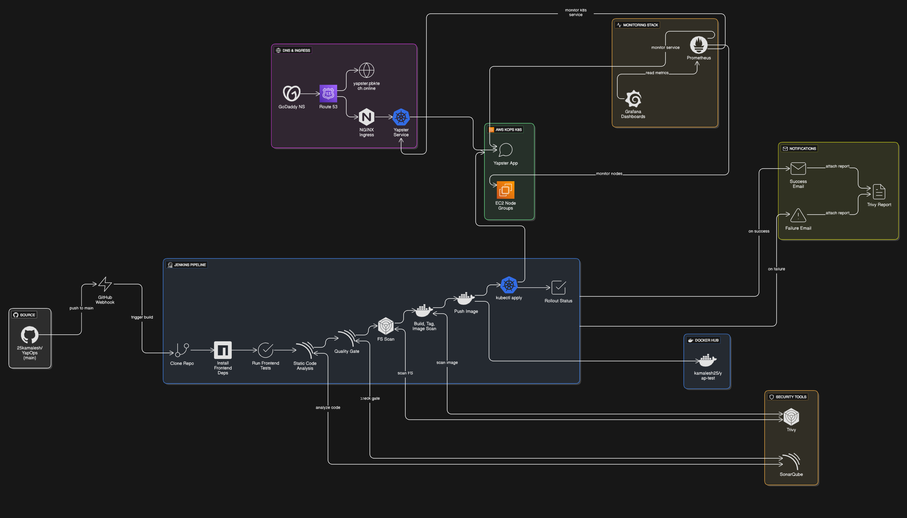
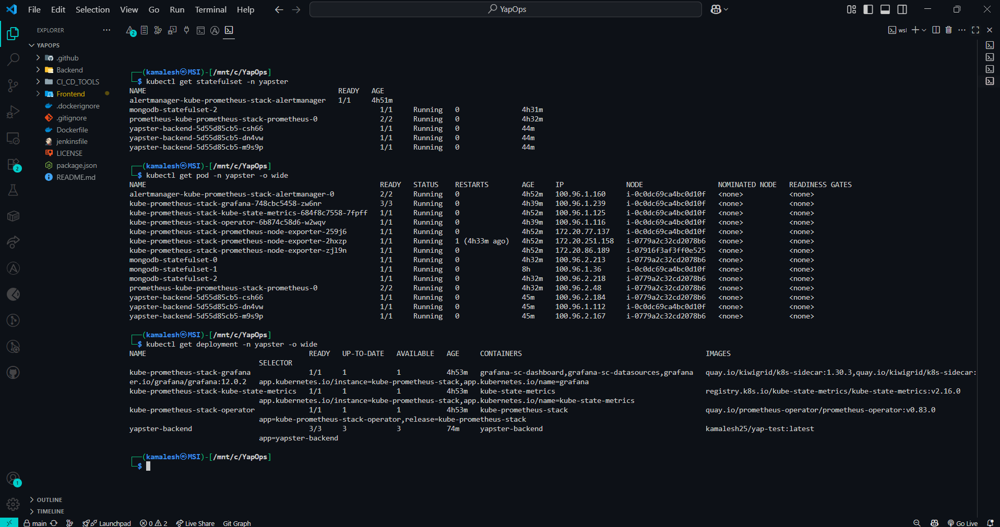
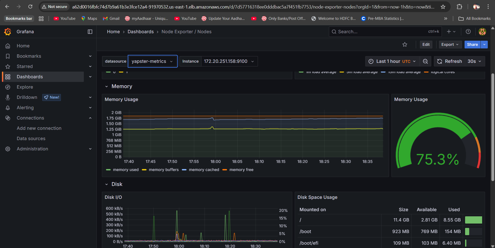
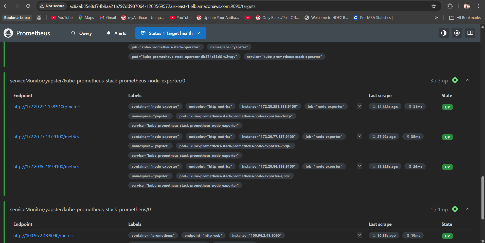
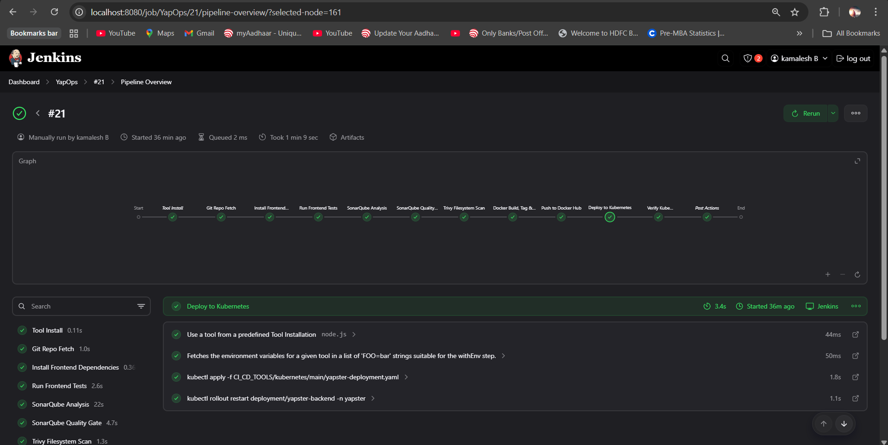
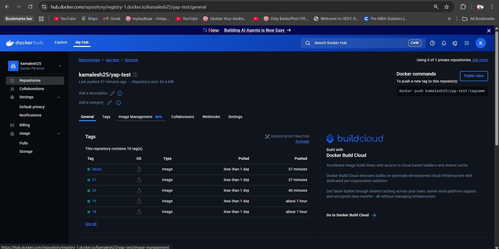
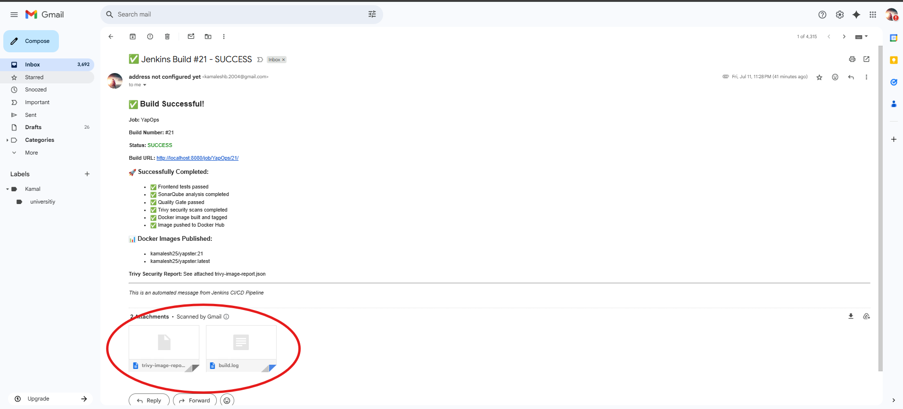

# YapOps - Full-Stack MERN Chat Application

<div align="center">
  <h3>🔄 A Modern Real-Time Chat Application with Enterprise-Grade DevOps</h3>
  <p>Built with MERN Stack, Socket.IO, Kubernetes, and CI/CD Pipeline</p>
</div>

## 📋 Table of Contents

- [Overview](#overview)
- [Features](#features)
- [Architecture](#architecture)
- [Tech Stack](#tech-stack)
- [Prerequisites](#prerequisites)
- [Local Development](#local-development)
- [Kubernetes Deployment](#kubernetes-deployment)
- [CI/CD Pipeline](#cicd-pipeline)
- [Monitoring & Observability](#monitoring--observability)
- [Configuration](#configuration)
- [API Documentation](#api-documentation)
- [Contributing](#contributing)
- [License](#license)

## 🎯 Overview

YapOps is a production-ready, full-stack real-time chat application built with the MERN stack. It features enterprise-grade DevOps practices including containerization, Kubernetes orchestration, comprehensive monitoring, and automated CI/CD pipelines.

### Key Highlights

- **Real-time messaging** with Socket.IO
- **Scalable architecture** with MongoDB replica sets
- **Kubernetes-native** deployment with RBAC
- **Comprehensive monitoring** with Prometheus & Grafana
- **Automated CI/CD** with Jenkins pipeline
- **Security-first** approach with Trivy scans and SonarQube analysis
- **Modern UI** with React and Tailwind CSS

### 📸 Application Preview

<div align="center">
  
  <p><em>Live Chat Application Interface</em></p>
</div>

### 🌐 Live Deployment

<div align="center">
  
  <p><em>Application Deployed on AWS</em></p>
</div>

## ✨ Features

### Core Features
- 🔐 **Authentication & Authorization** - JWT-based secure authentication
- 💬 **Real-time Messaging** - Instant messaging with Socket.IO
- 👥 **User Management** - Profile management and user discovery
- 🌙 **Theme Support** - Light/dark mode toggle
- 📱 **Responsive Design** - Mobile-first responsive UI
- 🔍 **Message Search** - Search through conversation history
- 🎨 **Modern UI** - Clean, intuitive interface with Tailwind CSS

### DevOps Features
- ☸️ **Kubernetes Deployment** - Production-ready K8s manifests
- 🔄 **CI/CD Pipeline** - Automated testing, building, and deployment
- 📊 **Monitoring & Alerts** - Comprehensive observability stack
- 🔒 **Security Scanning** - Trivy vulnerability scanning
- 📈 **Code Quality** - SonarQube static analysis
- 🗄️ **Database Replication** - MongoDB replica set for high availability

## 🏗️ Architecture

<div align="center">
  
  <p><em>Complete System Architecture</em></p>
</div>

```
┌─────────────────┐    ┌─────────────────┐    ┌─────────────────┐
│   React Frontend │    │  Express Backend │    │   MongoDB       │
│   (Port 3000)   │◄──►│   (Port 4000)   │◄──►│   (Port 27017)  │
│                 │    │                 │    │                 │
│ • React Router  │    │ • Socket.IO     │    │ • Replica Set   │
│ • Zustand       │    │ • JWT Auth      │    │ • Persistent    │
│ • Tailwind CSS  │    │ • Cloudinary    │    │   Storage       │
│ • Socket.IO     │    │ • Prometheus    │    │                 │
└─────────────────┘    └─────────────────┘    └─────────────────┘
         │                       │                       │
         └───────────────────────┼───────────────────────┘
                                 │
                    ┌─────────────────┐
                    │   Kubernetes    │
                    │                 │
                    │ • Deployments   │
                    │ • Services      │
                    │ • Ingress       │
                    │ • ConfigMaps    │
                    │ • Secrets       │
                    │ • RBAC          │
                    └─────────────────┘
```

### Monitoring Stack
```
┌─────────────────┐    ┌─────────────────┐    ┌─────────────────┐
│   Prometheus    │◄──►│    Grafana      │    │   AlertManager  │
│   (Port 9090)   │    │   (Port 3000)   │    │   (Port 9093)   │
│                 │    │                 │    │                 │
│ • Metrics       │    │ • Dashboards    │    │ • Notifications │
│ • Alerting      │    │ • Visualization │    │ • Routing       │
│ • Service       │    │ • Monitoring    │    │ • Silencing     │
│   Discovery     │    │   UI            │    │                 │
└─────────────────┘    └─────────────────┘    └─────────────────┘
```

## 🛠️ Tech Stack

### Frontend
- **React 19** - Modern React with latest features
- **Vite** - Fast build tool and dev server
- **Tailwind CSS** - Utility-first CSS framework
- **Zustand** - Lightweight state management
- **React Router** - Client-side routing
- **Socket.IO Client** - Real-time communication
- **Axios** - HTTP client
- **Lucide React** - Modern icon library

### Backend
- **Node.js** - JavaScript runtime
- **Express.js** - Web framework
- **Socket.IO** - Real-time communication
- **MongoDB** - Document database
- **Mongoose** - MongoDB ODM
- **JWT** - Authentication tokens
- **bcryptjs** - Password hashing
- **Cloudinary** - Image/file storage
- **Prometheus Client** - Metrics collection

### DevOps & Infrastructure
- **Kubernetes** - Container orchestration
- **Jenkins** - CI/CD automation
- **Helm** - Kubernetes package manager
- **Prometheus** - Monitoring and alerting
- **Grafana** - Visualization and dashboards
- **Trivy** - Security vulnerability scanner
- **SonarQube** - Code quality analysis

## 📋 Prerequisites

Before running this application, ensure you have the following installed:

### For Local Development
- **Node.js** (v18 or higher)
- **npm** or **yarn**
- **MongoDB** (v5.0 or higher)
- **Git**


### For Kubernetes Deployment
- **Kubernetes cluster** (v1.25 or higher)
- **kubectl** (configured to access your cluster)
- **Helm** (v3.0 or higher)

### For CI/CD Pipeline
- **Jenkins** (v2.400 or higher)
- **Kubernetes access** (for deployment)

## 🚀 Local Development

### 1. Clone the Repository
```bash
git clone https://github.com/25kamalesh/YapOps.git
cd YapOps
```

### 2. Install Dependencies
```bash
# Install root dependencies
npm install

# Install backend dependencies
cd Backend
npm install

# Install frontend dependencies
cd ../Frontend
npm install
```

### 3. Environment Configuration

Create environment files:

**Backend (.env)**
```env
PORT=4000
MONGO_URI=mongodb://localhost:27017/yapops
JWT_SECRET=your-super-secret-jwt-key
NODE_ENV=development
CLOUDINARY_CLOUD_NAME=your-cloudinary-cloud-name
CLOUDINARY_API_KEY=your-cloudinary-api-key
CLOUDINARY_API_SECRET=your-cloudinary-api-secret
```

**Frontend (.env)**
```env
VITE_API_URL=http://localhost:4000
```

### 4. Start MongoDB
```bash
# Start MongoDB service
mongod --dbpath /path/to/your/db
```

### 5. Run the Application

**Option 1: Run separately**
```bash
# Terminal 1 - Backend
cd Backend
npm run dev

# Terminal 2 - Frontend
cd Frontend
npm run dev
```

**Option 2: Run concurrently**
```bash
# From root directory
npm run build
npm start
```

### 6. Access the Application
- **Frontend**: http://localhost:3000
- **Backend API**: http://localhost:4000
- **MongoDB**: mongodb://localhost:27017


## ☸️ Kubernetes Deployment

### 1. Prerequisites

Ensure you have a Kubernetes cluster running and `kubectl` configured.

### 2. Create Namespace
```bash
kubectl create namespace yapster
```

### 3. Deploy MongoDB Replica Set
```bash
# Apply MongoDB configurations
kubectl apply -f CI_CD_TOOLS/kubernetes/Storage/
kubectl apply -f CI_CD_TOOLS/kubernetes/ENV_VARS/mongodb-vars/
kubectl apply -f CI_CD_TOOLS/kubernetes/main/statefulSet.yaml
kubectl apply -f CI_CD_TOOLS/kubernetes/Services/mongo-headless.yaml
```

### 4. Deploy Application
```bash
# Apply application configurations
kubectl apply -f CI_CD_TOOLS/kubernetes/ENV_VARS/yapster-vars/
kubectl apply -f CI_CD_TOOLS/kubernetes/main/yapster-deployment.yaml
kubectl apply -f CI_CD_TOOLS/kubernetes/Services/
```

### 5. Configure RBAC
```bash
# Apply RBAC configurations
kubectl apply -f CI_CD_TOOLS/kubernetes/ServiceAccount/
```

### 6. Setup Ingress
```bash
# Apply ingress configuration
kubectl apply -f CI_CD_TOOLS/kubernetes/main/yapster-ingress-simple.yaml
```

### 7. Verify Deployment
```bash
# Check pods
kubectl get pods -n yapster

# Check services
kubectl get svc -n yapster

# Check ingress
kubectl get ingress -n yapster
```

### 📸 Kubernetes Deployment Proof

<div align="center">
  
  <p><em>Kubernetes Resources Successfully Deployed</em></p>
</div>

## 📊 Monitoring & Observability

### Deploy Monitoring Stack

1. **Install kube-prometheus-stack**
```bash
# Add Prometheus community Helm repository
helm repo add prometheus-community https://prometheus-community.github.io/helm-charts
helm repo update

# Install Prometheus, Grafana, and AlertManager
helm install monitoring prometheus-community/kube-prometheus-stack \
  --namespace monitoring \
  --create-namespace
```

2. **Access Grafana Dashboard**
```bash
# Get Grafana admin password
kubectl get secret --namespace monitoring monitoring-grafana -o jsonpath="{.data.admin-password}" | base64 --decode

# Port-forward to access Grafana
kubectl port-forward --namespace monitoring svc/monitoring-grafana 3000:80
```

3. **Access Prometheus**
```bash
# Port-forward to access Prometheus
kubectl port-forward --namespace monitoring svc/monitoring-kube-prometheus-prometheus 9090:9090
```

### Monitoring Endpoints
- **Grafana**: http://localhost:3000 (admin/password from secret)
- **Prometheus**: http://localhost:9090
- **AlertManager**: http://localhost:9093

### 📸 Monitoring Stack Screenshots

#### Grafana Dashboard
<div align="center">
  
  <p><em>Grafana Dashboard - Real-time Application Metrics</em></p>
</div>

#### Prometheus Metrics
<div align="center">
  
  <p><em>Prometheus Metrics Collection and Monitoring</em></p>
</div>

## 🔄 CI/CD Pipeline

### Jenkins Pipeline Setup

1. **Install Jenkins Plugins**
   - Kubernetes
   - SonarQube Scanner
   - Trivy

2. **Configure Jenkins**
   - Add GitHub credentials
   - Configure SonarQube server
   - Setup Kubernetes cluster access

3. **Pipeline Stages**
   - **Git Checkout**: Fetch source code
   - **Build**: Install dependencies and build application
   - **Test**: Run unit tests
   - **SonarQube Analysis**: Code quality scan
   - **Security Scan**: Trivy vulnerability assessment
   - **Deploy**: Deploy to Kubernetes

### Pipeline Configuration

The Jenkins pipeline is defined in `jenkinsfile` and includes:

```groovy
pipeline {
    agent any
    tools {
        nodejs 'node.js'
    }
    environment {
        IMAGE_NAME = 'kamalesh25/yap-test'
        IMAGE_TAG = "${BUILD_NUMBER}"
    }
    
    stages {
        stage('Git Repo Fetch') { ... }
        stage('Build') { ... }
        stage('Test') { ... }
        stage('SonarQube Analysis') { ... }
        stage('Security Scan') { ... }
        stage('Deploy to Kubernetes') { ... }
    }
}
```

### 📸 CI/CD Pipeline Proof of Work

#### Jenkins Pipeline Execution
<div align="center">
  
  <p><em>Complete Jenkins Pipeline - All Stages Passed Successfully</em></p>
</div>

#### SonarQube Code Quality Analysis
<div align="center">
  
  <p><em>SonarQube Code Quality and Security Analysis</em></p>
</div>

#### Docker Repository
<div align="center">
  
  <p><em>Docker Images Published to Registry</em></p>
</div>

#### Email Notifications
<div align="center">
  
  <p><em>Automated Email Notifications for Pipeline Status</em></p>
</div>

## ⚙️ Configuration

### Environment Variables

#### Backend Configuration
| Variable | Description | Default |
|----------|-------------|---------|
| `PORT` | Server port | `4000` |
| `MONGO_URI` | MongoDB connection string | `mongodb://localhost:27017/yapops` |
| `JWT_SECRET` | JWT signing secret | Required |
| `NODE_ENV` | Environment mode | `development` |
| `CLOUDINARY_CLOUD_NAME` | Cloudinary cloud name | Required |
| `CLOUDINARY_API_KEY` | Cloudinary API key | Required |
| `CLOUDINARY_API_SECRET` | Cloudinary API secret | Required |

#### Frontend Configuration
| Variable | Description | Default |
|----------|-------------|---------|
| `VITE_API_URL` | Backend API URL | `http://localhost:4000` |

### Kubernetes ConfigMaps and Secrets

- **ConfigMaps**: Non-sensitive configuration data
- **Secrets**: Sensitive data like API keys and passwords
- **Storage**: Persistent volume configurations

## 📚 API Documentation

### Authentication Endpoints
- `POST /api/auth/signup` - Register new user
- `POST /api/auth/login` - User login
- `POST /api/auth/logout` - User logout
- `GET /api/auth/check` - Check authentication status

### Message Endpoints
- `GET /api/messages/:userId` - Get messages with user
- `POST /api/messages/send/:userId` - Send message to user
- `GET /api/messages/users` - Get all users for sidebar

### Socket.IO Events
- `connection` - User connects
- `disconnect` - User disconnects
- `newMessage` - New message received
- `getOnlineUsers` - Get online users list

## 🤝 Contributing

We welcome contributions to YapOps! Please follow these guidelines:

1. **Fork the repository**
2. **Create a feature branch**
   ```bash
   git checkout -b feature/amazing-feature
   ```
3. **Commit your changes**
   ```bash
   git commit -m 'Add amazing feature'
   ```
4. **Push to the branch**
   ```bash
   git push origin feature/amazing-feature
   ```
5. **Open a Pull Request**

### Development Guidelines
- Follow ESLint configuration
- Write unit tests for new features
- Update documentation for API changes
- Ensure all CI/CD checks pass
- Follow conventional commit messages

### Code Style
- Use Prettier for code formatting
- Follow JavaScript/React best practices
- Write meaningful commit messages
- Add comments for complex logic

## 📄 License

This project is licensed under the MIT License. See the [LICENSE](LICENSE) file for details.

---

<div align="center">
  <p>⭐ Star this repository if you find it helpful!</p>
</div>